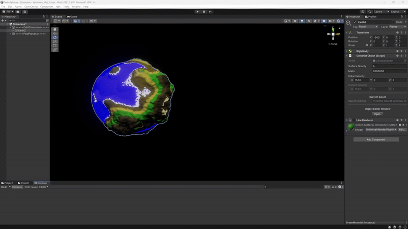

  Get in touch: 
  

<h1 align="center">Hi! I'm Felix 👋</h1> 

🌍 <b>Game Programmer | Engine Tools | Performance Optimization</b>

🎮 <b>Specializing in Unity & Unreal Engine</b>

📍 Based in Hamburg, Germany
 

<h3 align="center">About Me</h3>

I'm <b>Felix Wahl</b>, a passionate game programmer specializing in <b>engine tools, performance optimization, and graphics programming</b>. My main focus is <b>C++ & Unreal Engine</b>, but I also work with <b>C#, Unity, and WPF</b>.
 

🔭 <b>Currently looking for:</b>
 

✅ New challenges as a <b>Unity or Unreal Developer / Tools Engineer</b>
 

✅ Deepening my <b>C++ & Unreal Engine expertise</b>
 

✅ Exciting team collaborations
 

---

## 🎮 Most Recent Project

### **🌌 The Obsidian Codex: Secrets of the Abyssal Archives (Unreal Engine C++)**  
📝 **Description:** A dark, atmospheric mini RPG set in the depths of an ancient dungeon.     
🔗 **[View on GitHub](https://github.com/goldbarth/TheObsidianCodex)**  

<!-- START_RECENTLY_WORKED_ON -->
## 🔄 Recently Worked On

| Feature | Last Commit Message | Last Updated |
|---------|----------------------|--------------|
| Add initial Unreal project using Top-Down template | 4 hours ago |
<!-- END_RECENTLY_WORKED_ON -->

---

## 🎮 Notable Projects   
🎥 *Click a preview to see project details!*  

| 🌌 Solar System | 💀 Edge of Sorrow | 🪐 Nebula Forge | 🧊 3D Model Viewer |
|------------------|----------------|--------------|------------------|
|  |  |  |  |

---

## 💻 Tech Stack  
🚀 **Languages & Engines:**  
-   
-    
-  
-   

🛠 **Development Tools:**  
- 
-   
- 
- 
---

## 🎯 Core Competencies  
✔ **Engine & Tools Development**  
✔ **Performance Optimization & Debugging**  
✔ **Unreal Engine C++ & Blueprint Integration**   
✔ **3D Graphics & Physics Simulations**   
✔ **Unity Engine C#**

---

## 🎮 Projects   

### **🌌 Solar System Simulation (Unreal Engine C++)**  
📝 **Description:** A fully documented, physics-driven solar system simulation using **C++ & Unreal Engine**. Features dynamic gravity, planetary orbits, and interactive adjustments.  
🔗 **[View on GitHub](https://github.com/goldbarth/SolarSystem)**  

---

### **💀 Edge of Sorrow (Unreal Engine C++)**  
⚡ **Description:** A fast-paced **retro FPS**, blending speed, skill, and action-packed gameplay.  
🔗 **[View on GitHub](https://github.com/goldbarth/EdgeOfSorrow)**  

---

### **🪐 Nebula Forge (Unity Engine C#)**
⚡ **Description:** A solar system simulator where you can change the laws of physics and watch the consequences unfold. It's also a project to learn about engine tools and performance optimization.   
🔗 **[View on GitHub](https://github.com/goldbarth/NebulaForge)**

---

### **🧊 3D Model Viewer (OpenGL C++)**  
⚡ **Description:** A model viewer to load OBJ´s for a basic graphics programming introduction.   
🔗 **[View on GitHub](https://github.com/goldbarth/3DModelViewer)**

---

## 📫 Connect with Me  
  
  
  
[<kbd>E-Mail</kbd>](mailto:felix.wahl@live.de)  

---

## 📊 GitHub Stats  

  
