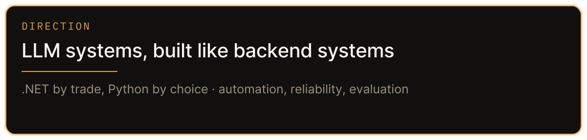
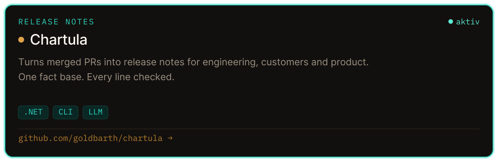
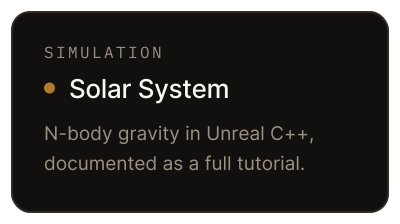
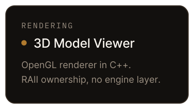
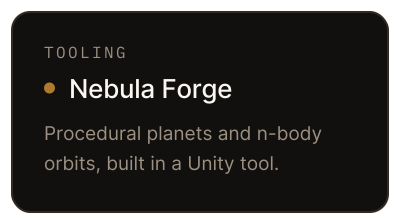
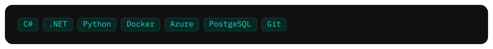
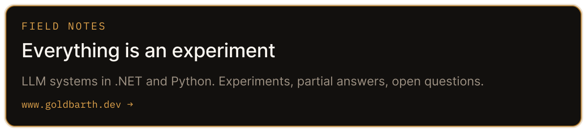
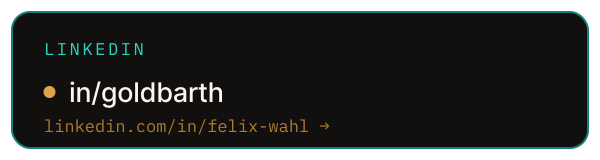
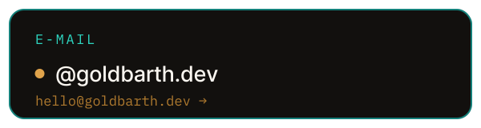

<picture>
  <source media="(prefers-color-scheme: light)" srcset="assets/light/header-light.svg">
  
</picture>

<picture>
  <source media="(prefers-color-scheme: light)" srcset="assets/light/direction-light.svg">
  
</picture>

<a href="https://github.com/goldbarth/chartula"><picture><source media="(prefers-color-scheme: light)" srcset="assets/light/chartula-light.svg"></picture></a>

<picture>
  <source media="(prefers-color-scheme: light)" srcset="assets/label-archive-light.svg">
  
</picture>
<a href="https://github.com/goldbarth/SolarSystem"><picture><source media="(prefers-color-scheme: light)" srcset="assets/light/solar-system-light.svg"></picture></a><a href="https://github.com/goldbarth/3DModelViewer"><picture><source media="(prefers-color-scheme: light)" srcset="assets/light/3d-model-viewer-light.svg"></picture></a><a href="https://github.com/goldbarth/NebulaForge"><picture><source media="(prefers-color-scheme: light)" srcset="assets/light/nebula-forge-light.svg"></picture></a>

<picture>
  <source media="(prefers-color-scheme: light)" srcset="assets/label-core-stack-light.svg">
  
</picture>
<picture>
  <source media="(prefers-color-scheme: light)" srcset="assets/light/stack-light.svg">
  
</picture>

<a href="https://www.goldbarth.dev/"><picture><source media="(prefers-color-scheme: light)" srcset="assets/light/blog-light.svg"></picture></a>

<a href="https://www.linkedin.com/in/felix-wahl"><picture><source media="(prefers-color-scheme: light)" srcset="assets/light/kontakt-linkedin-light.svg"></picture></a><a href="mailto:hello@goldbarth.dev"><picture><source media="(prefers-color-scheme: light)" srcset="assets/light/kontakt-mail-light.svg"></picture></a>
